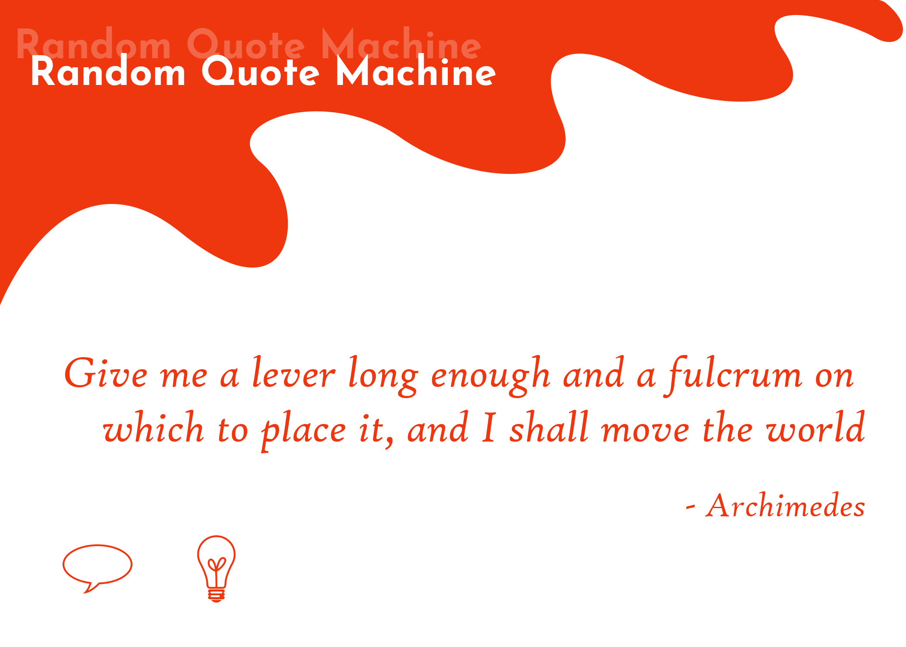

# [Random-Quote-Machine](https://codepen.io/borntofrappe/full/VQYmpJ/)

Build a single page application to 

1. get a random quote
2. possibly share said quote on twitter

This following a [Freecodecamp](Freecodecamp.org) challenge, specifically the first project in the line of 
'Intermediate Front End Development Projects'.

Feel free to download for your own amusement. Or check it out on [codepen](https://codepen.io/borntofrappe/full/VQYmpJ/) if you so wish. 

## Design 

Following a first draft for the project the single page application is divided into two main sections.

### 1. The Header

For the title of the page and also the call-to-action elements. This section is used to first explain the purpose of the page itself and to introduce the possible actions to be taken in the page context.

This portion is populated by static elements, meaning text and icons attached to it.

### 2. The Content

For the information regarding the quote, its text and its connected author if available. 

This portion is populated by quotes from the [Forismatic API](https://forismatic.com/en/api/). Content is therefore dynamically added through the API and jQuery. Depending on these two elements it requires internet connection.

## External Resources 

Beside HTML, CSS and JS file, the project relies on different external libraries, hereby briefly referenced.

- [Font Awesome](http://fontawesome.io/)

  In order to include one icon for each call-to-action element. 
  
- [jQuery](http://code.jquery.com/)

  In order to easily react to click and event and change the content of html element.
  
- [Forismatic API](https://forismatic.com/en/api/)

  In order to retrieve quotes, their text and connected author, if available.
  
